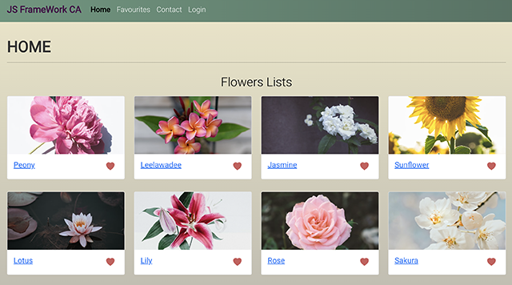

# JS FrameWork Course Assignment 2

JS FrameWork Course Assignment 2 is made with React, React-Bootstrap and SASS. Using Wordpress API



## Description

To do Login functionality using a Wordpress API with the JWT plugin. Using react-hook-form and yup for Form validation.
Website using data from WordPress API.

There are 2 sections of website.

### Customer-facing:

-   **Homepage** with items(flowers) list.
-   **Detail page** show detail of item.
-   **Contact** Show contact form with validation.

    a form with the following inputs and validation:

    -   **_First name_** - required, minimum 3 characters
    -   **_Last name_** - required, minimum 4 characters
    -   **_Email_** - required, must be in a valid email format
    -   **_Subject_** - required, this must be a select box with at least 2 options
    -   **_Message_** - required, minimum 10 characters.

-   **Login** Create a form with username/email and password fields.

### Admin section:

-   This page will simply display an "Admin" heading.

## Built With

-   [React](https://reactjs.org/)
-   [React-bootStrap](https://react-bootstrap.github.io/)
-   [Sass](https://www.npmjs.com/package/node-sass)
-   [React-hook-form](https://www.npmjs.com/package/react-hook-form)
-   [Yup](https://www.npmjs.com/package/yup)

### Installing

1. Clone the repo:

```bash
git clone https://github.com/Noroff-FEU-Assignments/js-frameworks-course-assignment-nunsinee.git
```

2. Install the dependencies:

```bash
npm install
```

### Package Dependencies

"@hookform/resolvers": "^2.8.8",
"@testing-library/jest-dom": "^5.16.3",
"@testing-library/react": "^12.1.4",
"@testing-library/user-event": "^13.5.0",
"axios": "^0.26.1",
"bootstrap": "^5.1.3",
"node-sass": "^7.0.1",
"react": "^17.0.2",
"react-bootstrap": "^2.2.2",
"react-dom": "^17.0.2",
"react-hook-form": "^7.28.1",
"react-icons": "^4.3.1",
"react-router-dom": "^6.2.2",
"react-scripts": "5.0.0",
"web-vitals": "^2.1.4",
"yup": "^0.32.11

### Release

[https://nv-js-frameworks-2.netlify.app/](https://nv-js-frameworks-2.netlify.app/)
